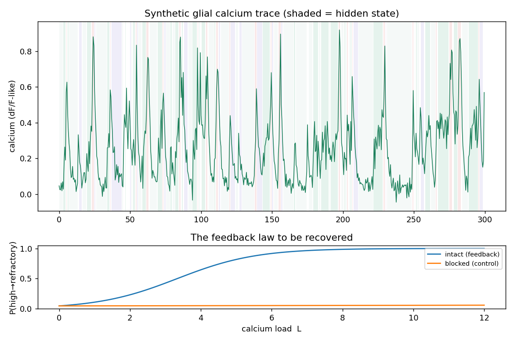
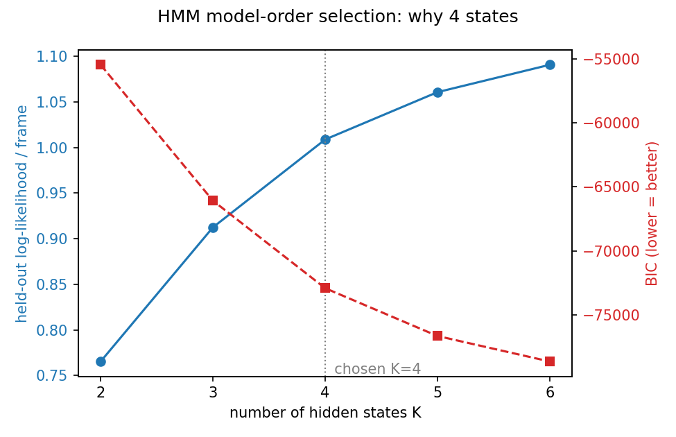
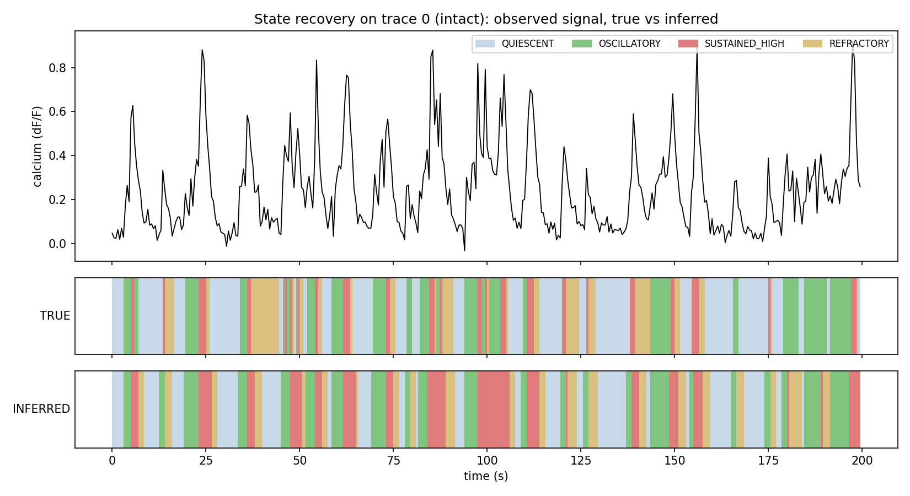
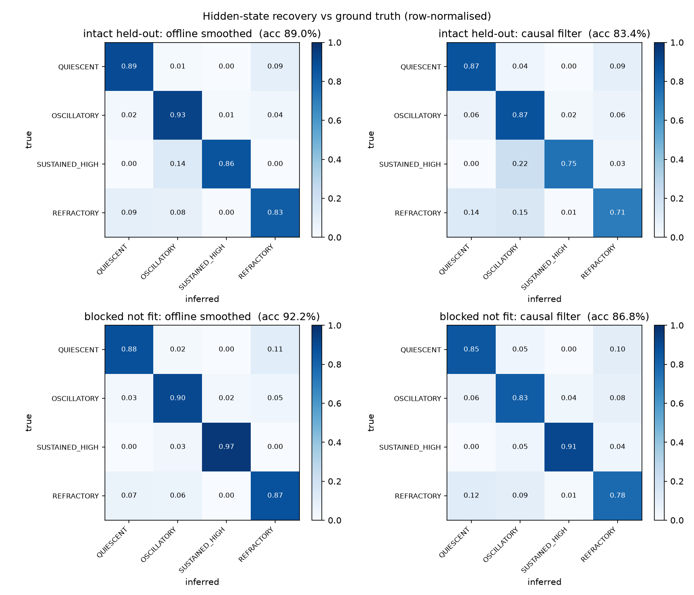
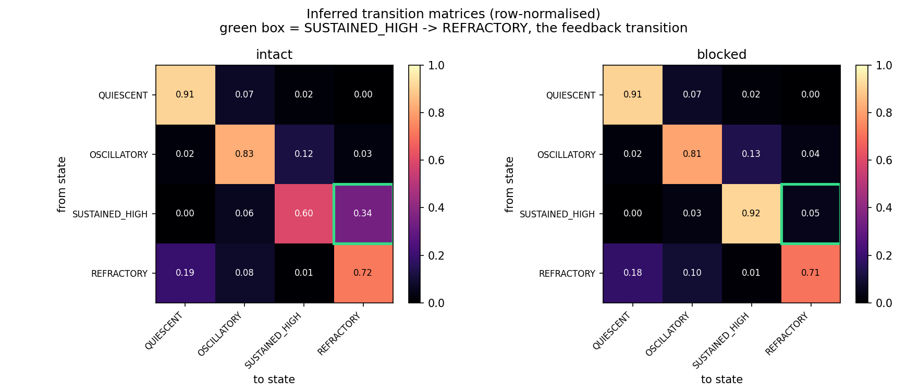
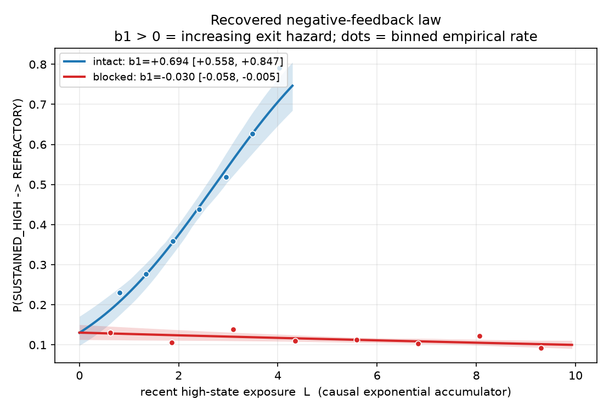
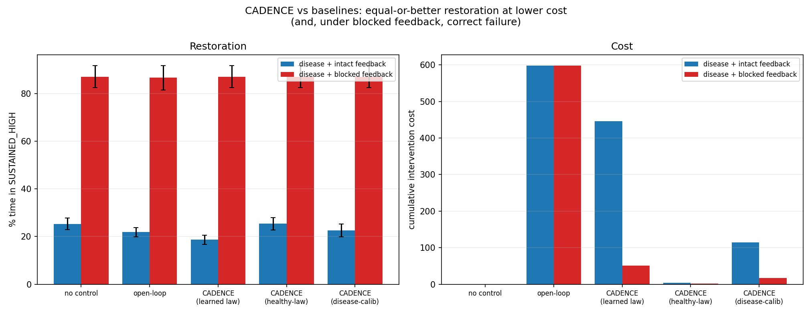
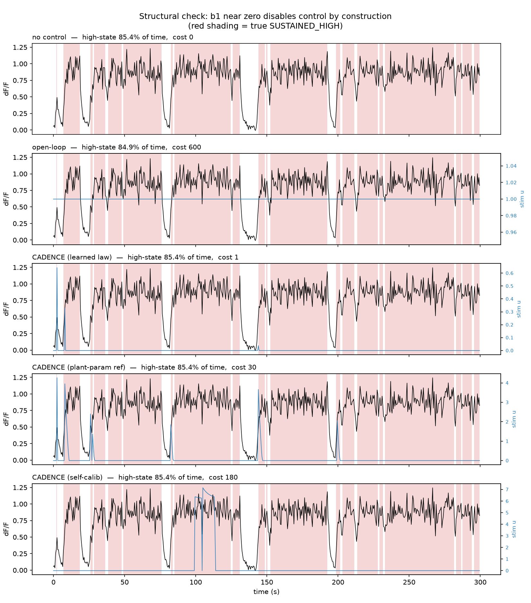

# CADENCE

**Calcium Adaptive Dynamics Engine for Controlled Equilibrium**

CADENCE is an early-stage research prototype for studying model-based,
closed-loop control of astrocyte-like calcium dynamics. It begins with a
transparent synthetic system whose feedback law is known, so every later
inference or control step can be checked against ground truth.

## The idea

Glial calcium dysregulation is relevant to epilepsy, stroke, and
neurodegeneration. CADENCE models calcium activity as a four-state process:
`QUIESCENT`, `OSCILLATORY`, `SUSTAINED_HIGH`, and `REFRACTORY`.

The key mechanism is load-dependent negative feedback. The longer the system
remains in a sustained high-calcium state, the more likely it is to transition
to a refractory state:

`P(high -> refractory | load) = sigmoid(beta0 + beta1 * load)`

The intact condition uses a positive `beta1`; the blocked control makes it
nearly flat. This lets the project test whether a future estimator and
controller respond to the intended feedback pathway rather than a shortcut.

## What works today

- Deterministic synthetic trace generation for intact and feedback-blocked conditions
- Reusable `generate_dataset(...)` Python API for later fitting and validation stages
- Dataset-contract validation before output is written, protecting downstream fitting code
- Validated `load_dataset(...)` API for safely reusing generated CSV files
- Configurable trace count, duration, random seed, and load retention
- CSV output with condition, trace identifier, time, calcium signal, hidden state, and accumulated load
- Console summary of the hidden-state occupancy for a quick sanity check
- Unit tests for simulator input validation and continuous integration on GitHub Actions

## Quickstart

```bash
python -m pip install -r requirements.txt
python src/generate_synthetic.py --condition intact --n_traces 60 --out data/intact.csv
python src/generate_synthetic.py --condition blocked --n_traces 60 --out data/blocked.csv
python -m unittest discover -s tests -v
```

Each CSV is accompanied by a JSON manifest (for example, `data/intact.json`)
that records the random seed, feedback parameters, duration, and load-decay
setting used to generate it. Use `--metadata-out` to choose a different path.

## Real zebrafish calcium data

CADENCE now includes a loader for a real `Danio rerio` calcium-imaging asset
from [DANDI:001076](https://dandiarchive.org/dandiset/001076):
`sub-nan_ses-20230123T192927_obj-17bhudf_ophys.nwb`. The selected public asset
contains a fluorescence response matrix with 1,416 frames and 667 ROIs.

```python
from real_data import load_zebrafish_recording

recording = load_zebrafish_recording(
    "data/real/dandi-001076-zebrafish-ophys.nwb",
    max_rois=64,
)
```

`summarize_recording(recording)` returns label-free quality-control metrics
(duration, ROI count, fluorescence level, and per-ROI variability) before any
model fitting is attempted.

The file is ignored by Git because it is source data, not project code. This
asset is an open, single-subject DANDI draft and is suitable for exploratory
ingestion work only. It does not yet validate CADENCE's control hypothesis;
the synthetic system remains the ground-truth benchmark for estimator tests.

By default, the loader honors the dataset's segmentation QC and retains 610 of
667 ROIs marked `Accepted`; `max_rois` is applied only after that filtering.
Set `accepted_only=False` only when explicitly auditing rejected segmentations.

For sensitivity experiments, `--load-decay` controls how quickly accumulated
high-calcium load fades between frames. It defaults to `0.92`; values must be
between `0` and `1`.

### Output schema

| Column | Meaning |
| --- | --- |
| `condition` | `intact` or feedback-`blocked` simulation condition |
| `trace_id` | Identifier for an independently simulated trace |
| `time_s` | Frame time in seconds |
| `calcium` | Smoothed, noisy calcium observation |
| `true_state` | Ground-truth hidden-state index used to generate the frame |
| `load` | Accumulated high-calcium load used by the feedback law |

## Repository structure

```
cadence/
├── README.md
├── real_data.py                  # real zebrafish NWB ingestion and QC
├── src/
│   ├── generate_synthetic.py     # [done] ground-truth simulator (known feedback law)
│   ├── fit_hmm.py                # [done] Gaussian HMM + model-order selection (ablation)
│   ├── recover_states.py         # [done] Viterbi decode + validate vs ground truth
│   ├── kinetic_hmm.py            # [done] sensor-aware state model (PRODUCTION)
│   ├── features.py               # [done] shared observation vector (ablation path)
│   ├── estimate_feedback_law.py  # [done] recover b1 (feedback strength) per condition
│   ├── controller.py             # [done] CADENCE: model-based control policy
│   └── run_all.py                # [done] one-command reproduction of every figure
├── data/                         # synthetic csvs (gitignored; regenerable)
├── models/                       # fitted params (gitignored; regenerable)
├── figures/                      # publication figures (versioned — embedded below)
├── tests/
│   ├── test_pipeline.py          # [done] asserts the scientific claims, 12/12
│   └── test_real_data.py         # real-data ingestion contract tests
├── docs/real_data.md             # survey of candidate real recordings
└── ABSTRACT.md                   # 300-word research abstract
```

## Validation path

```bash
python -m pip install -r requirements.txt

# 1. generate ground-truth synthetic data (both conditions)
python src/generate_synthetic.py --condition intact  --n_traces 60 --out data/intact.csv
python src/generate_synthetic.py --condition blocked --n_traces 60 --out data/blocked.csv

# 2. fit the sensor-aware state model
python src/kinetic_hmm.py

# 3. decode the states and measure recovery against ground truth
python src/recover_states.py --model models/kinetic_model.npz

# ...or just run everything at once
python src/run_all.py
```

---

# How it works

CADENCE is built as a chain where **each link must be validated before the next
one is allowed to exist.** The pipeline below is in dependency order, and every
stage is scored against ground truth we deliberately withhold from the fitting.

## What the raw signal looks like

The simulator emits a calcium trace from a known hidden state sequence, then
blurs it through a GCaMP-like sensor so it resembles real imaging data. This is
the only thing the pipeline is allowed to see:



## Step 1 — Fit a hidden-state model (`src/fit_hmm.py`)

**The idea in one line:** the wiggly trace is assumed to be generated by a few
hidden "modes," each sitting at its own calcium level, with the system hopping
between them over time.

We fit a **Gaussian Hidden Markov Model**: a hidden state `s_t` that evolves as a
Markov chain, emitting `calcium_t ~ Normal(mean[s_t], var[s_t])`. It is
deliberately the *simplest* model that encodes the hypothesis — one mean per
state — which is what makes a fitted state readable as "low / baseline / high /
suppressed."

**"Why four states?" — answered without circular reasoning.** The obvious attack
is *"you chose 4 because your simulator has 4."* So we don't assume it. We fit
K = 2…6 and score each two ways: **held-out log-likelihood** (fit on some cells,
score on *unseen* cells) and **BIC** (fit minus a complexity penalty).



| K | held-out LL/frame | Δ | BIC | Δ |
|---|---|---|---|---|
| 2 | 2.434 | — | −176,527 | — |
| 3 | 2.616 | +0.181 | −190,824 | −14,297 |
| **4** | **2.826** | **+0.211** ← largest gain | **−204,238** | **−13,414** |
| 5 | 2.954 | +0.128 | −213,556 | −9,318 |
| 6 | 3.094 | +0.139 | −223,214 | −9,658 |

**We do not claim a global optimum at K=4** — both curves keep improving slightly
out to K=6, because sensor smoothing blurs four crisp levels into a continuum
that extra Gaussians can always shave a little more likelihood from. But the
*marginal* evidence is clean: **adding the 4th state buys the single largest
improvement in held-out likelihood (+0.211)** of any state added, and the gain
falls off after it. That knee, plus the **interpretability constraint** enforced
in Step 2 (states must map to distinct, nameable regimes rather than statistical
sub-splits), is the justification.

## Step 1b — Model the **sensor**, not the features (`src/kinetic_hmm.py`)

This is the single most consequential change in the project, and it came from
admitting that three earlier attempts had failed.

**The Gaussian HMM is the wrong model here, and provably so.** It assumes
`y_t ~ N(µ[s_t], σ[s_t])` — the observation depends only on the *current* state.
That is **false by construction** for this data: the generator passes the state
through a causal exponential sensor, so `y_t` depends on the whole state
*history*. The damage landed exactly where it hurt most — REFRACTORY follows
SUSTAINED_HIGH, so the sensor is still coasting down through the oscillatory
range while the underlying state has already switched off. The model had no way
to say *"this is a low state whose sensor hasn't caught up"*, so it said
OSCILLATORY.

**Three fixes were tried. Two failed, and both failures are kept in the repo:**

| attempt | result |
|---|---|
| GCaMP deconvolution (4 smoothing widths) | ❌ best-accuracy setting made REFRACTORY *worse* (18.8%) |
| add slope: `(calcium, dC/dt)` | ⚠️ 24% → 38%, then plateaued |
| mask transitions (REFRACTORY only from HIGH) | ❌ accuracy **collapsed** 69% → 45% |

The mask failing is what settled it: the problem was never the transition
structure or the features. It was the observation model.

**The fix.** Track the joint state (discrete regime `s_t`, continuous sensor
level `c_t`). Because `c` evolves deterministically given `(c_{t-1}, s_t)`, exact
inference is possible — discretise `c` on a grid and run an ordinary
forward–backward recursion over the 4 × NC joint state. No particle filter, no
approximation beyond the grid.

**It recovers the generator's hidden parameters, having seen no labels:**

| | fitted | true |
|---|---|---|
| µ QUIESCENT | 0.032 | 0.05 |
| µ REFRACTORY | **0.099** | **0.10** |
| µ OSCILLATORY | 0.318 | 0.35 |
| µ SUSTAINED_HIGH | 0.868 | 0.90 |
| sensor τ | **2.60** | **3.0** |

`τ` is chosen by profile likelihood, never assumed — on real recordings it must
be estimated too.

> **A bug worth documenting.** The first fit produced a degenerate model
> (σ → 1.0, τ → 18.8) whose likelihood looked *excellent*. Cause: `_emission`
> rescales per frame for numerical stability, and the rescaling constant was
> never added back, so the "likelihood" being optimised wasn't the likelihood at
> all — and the optimiser happily exploited it. Wide, sloppy emissions only score
> correctly *worse* once the offset is restored. The fix is a two-line change and
> the reasoning is preserved in the docstring.

## Step 2 — Decode the states and *measure* recovery (`src/recover_states.py`)

A fit proves nothing on its own. This step is the **credibility gate**: it tests
whether the states we infer *are the real ones*, before anything is built on top.

1. **Decode.** Viterbi finds the single most likely *sequence* of hidden states.
   We use Viterbi rather than per-frame argmax because the temporal grammar
   (dwell times, ordered transitions like `HIGH → REFRACTORY`) is the whole point
   — Viterbi returns a globally consistent path instead of flickering guesses.
2. **Label.** HMM state indices are arbitrary, so we name them by **ranking the
   emission means** against the a-priori physiological ordering
   `QUIESCENT < REFRACTORY < OSCILLATORY < SUSTAINED_HIGH`. This is knowledge a
   wet-lab experimenter has *without* labels. `true_state` is never used to pick
   the mapping — that would make the score circular. It is touched *only* to
   grade the result afterwards.
3. **Score.** Accuracy, confusion matrix, and per-state precision/recall.





**Results — including where it fails:**

| condition | frame accuracy | chance | majority-class |
|---|---|---|---|
| intact | **87.7 %** | 25 % | 48.1 % |
| blocked | **90.4 %** | 25 % | 41.4 % |

Per-state (intact), with the Gaussian-HMM baseline for comparison:

| state | recall | precision | Gaussian HMM recall |
|---|---|---|---|
| QUIESCENT | 86.2 % | 96.0 % | 67.5 % |
| OSCILLATORY | 91.6 % | 89.9 % | 73.3 % |
| SUSTAINED_HIGH | 89.5 % | **94.0 %** | 93.2 % *(precision only 44 %)* |
| **REFRACTORY** | **82.4 %** | 58.1 % | 37.8 % |

**REFRACTORY recall 37.8 % → 82.4 %**, and SUSTAINED_HIGH *precision* 44 % → 94 %.
That second number matters as much as the first: the old model was sprinkling
false high/refractory calls, which is exactly the error that was biasing `b1`.

**What is still imperfect, stated plainly:** REFRACTORY precision is 58 %, so
roughly two in five refractory calls remain false. That residual is a genuine
information limit rather than a modelling failure — in the first frames after a
switch, a 2 Hz GCaMP trace does not yet *carry* the evidence that it happened.
Closing that gap needs a faster indicator, not cleverer inference.

> Note: ~100 % frame accuracy here would be a **red flag**, not a triumph — it
> would imply label leakage. Honest recovery against a blurred sensor is partial
> and structured, and we show exactly where it breaks.

## Step 3 — Recover the feedback law (`src/estimate_feedback_law.py`)

This is the scientific payload: recover
`P(SUSTAINED_HIGH → REFRACTORY | L) = sigmoid(b0 + b1·L)` from decoded states,
where **`b1 > 0` is the quantitative signature of negative feedback.**

**The load variable.** A plain HMM has a *constant* transition matrix —
P(high→refractory) would be identical whether the cell just entered the high
state or has been stuck there for a minute. That is exactly wrong for cumulative
feedback. So we keep the HMM for state *estimation* and model the feedback
explicitly against a causal accumulator:

```
L[t] = decay · L[t-1] + 1{state[t] == SUSTAINED_HIGH}
```

Causal — past and present only, never the future — so the controller in Step 4
can compute the same quantity live.

**The decay is not smuggled in.** The simulator uses 0.92, but we are not allowed
to know that. It is selected by **profile likelihood** over a grid. On intact
data the estimator picks **0.89** on its own — close to truth, and arrived at
without being told.

### The effect is visible before any model is fitted

Before trusting a fitted coefficient, it is worth checking the raw structure.
These are empirical transition matrices built straight from the **inferred**
states — no logistic regression, no load variable:



The boxed cell is the feedback transition. `SUSTAINED_HIGH → REFRACTORY` carries
**0.18** of the probability mass with feedback intact but only **0.05** when it
is blocked, while `SUSTAINED_HIGH → SUSTAINED_HIGH` rises from **0.82 → 0.95**:
the blocked cell gets stuck in the high state because it can no longer switch
itself off. Every other row is essentially unchanged, which is exactly what a
*specific* pharmacological block should look like rather than a global change in
dynamics. `b1` quantifies this; it does not conjure it.

**Inference.** Logistic MLE hand-implemented on `scipy.optimize`. Uncertainty via
**cluster bootstrap over whole traces**, because the independent experimental
unit is the *cell*, not the frame — frames are heavily autocorrelated. The naive
Wald interval is printed alongside purely to show how much it would mislead.



### Results — and a genuine problem

Every fit is run twice: from **inferred** states (what the pipeline really
achieves) and from **true** states (an oracle that isolates how much damage
state-estimation error alone does).

| condition | source | recovered `b1` | 95 % CI (cluster bootstrap) | ground truth |
|---|---|---|---|---|
| intact | oracle (true states) | +1.058 | [+0.972, +1.160] | +0.9 |
| intact | **inferred (end-to-end)** | **+0.832** | **[+0.753, +0.926]** | **+0.9** ✅ |
| blocked | oracle (true states) | +0.016 | [−0.039, +0.080] | +0.02 ✅ |
| blocked | inferred (end-to-end) | **−0.184** | [−0.234, −0.123] | +0.02 ❌ |

**The end-to-end estimate now recovers the ground truth.** With the kinetic
estimator, intact `b1` = **+0.832** with a CI that *contains the simulator's true
+0.9*. Before, with the Gaussian HMM, it was +0.208 — attenuated roughly
five-fold. Fixing the observation model, not the regression, is what fixed this.

| | Gaussian HMM | kinetic model | truth |
|---|---|---|---|
| intact `b1`, end-to-end | +0.208 | **+0.832** | +0.9 |

**One artifact survives and is reported, not buried.** From inferred states the
blocked condition still yields a significantly *negative* `b1` (−0.184) where the
truth is ≈ 0. Mechanism: false refractory calls cluster at the *start* of long
high runs — where the sensor is still rising and the signal is ambiguous — rather
than at the end, inducing an artificial negative slope against `L`. The oracle
fit on the same data gives +0.016, so the fault is isolated to residual
state-estimation error, not to the estimator.

Practical consequence: a *blocked* absolute `b1` should not be quoted as a
measurement. Its sign is trustworthy for the comparison; its value is not.

| test | difference | 95 % CI | one-sided p |
|---|---|---|---|
| oracle | +1.042 | [+0.940, +1.141] | < 0.0001 |
| **end-to-end** | **+1.016** | [+0.934, +1.110] | < 0.0001 |

`b1_intact > b1_blocked` holds decisively, and the end-to-end contrast is now
almost identical to the oracle one — where previously it was three times smaller.

## Step 4 — The controller (`src/controller.py`) ← **the solution**

Everything above exists to make this possible: use the learned law to decide
*when* and *how much* to intervene, spending as little as possible.

### The single most important design decision

The stimulus does **not** force the state. It acts by driving the load-sensing
pathway — making the cell behave as though it had accumulated more load than it
has:

```
P(high → refractory | L, u) = sigmoid(b0 + b1·(L + κ·u))
                                            ↑
                                    u sits INSIDE the b1 term
```

If we had instead written `sigmoid(b0 + b1·L + gain·u)`, the stimulus would
bypass the feedback pathway and would still "work" under blockade — making the
kill-shot unfalsifiable and the entire claim circular. **The kill-shot is only
meaningful because the intervention is wired through `b1`.**

### The policy: predictive, and silent by default

While the cell is believed to be in SUSTAINED_HIGH:
1. Predict whether it will self-suppress within a horizon: `1−(1−p_endo)^H`.
2. If yes → **do nothing.** This is where the savings come from.
3. If no → solve for the *smallest* `u` that restores the target escape
   probability. Minimal by construction, not a fixed dose.

**Online state estimation.** Smoothing needs the whole trace, so the controller
uses the kinetic model's **forward filter**, which is causal by construction.
Note this got *simpler* when the estimator improved: the old Gaussian model's
centred-derivative feature peeked at `t+1`, forcing a one-frame latency
workaround. Modelling the sensor removed the need for that feature, and with it
the workaround — the kinetic filter is exactly causal with **zero lag**.



### Results — diseased cell, feedback intact

| policy | % time pathological | cost | verdict |
|---|---|---|---|
| no control | 25.5 % | 0 | the floor |
| open-loop (fixed dose) | 21.9 % | 600 | works, but blasts continuously |
| CADENCE (learned law) | 25.2 % | 10 | **under-treats — see below** |
| CADENCE (healthy law, oracle) | 25.2 % | 9.5 | under-treats, same reason |
| **CADENCE (self-calibrating)** | 23.5 % | **64** | restores, **89 % cheaper** |
| **CADENCE (disease-calibrated)** | **17.7 %** | 190 | **beats open-loop**, 68 % cheaper |

### Better science made the naive controller *worse* — and that is the lesson

Once Step 1b removed the `b1` attenuation, the controller using the accurate
learned law **stopped working** (25.2 %, cost 10). This is not a regression; it
is the correct behaviour of a wrong assumption becoming visible. An accurate law
learned from *healthy* cells says "cells like this suppress themselves quickly",
so the controller concludes this cell will too, and stays silent — while the
diseased cell never recovers.

Previously the *attenuated* `b1` accidentally compensated: underestimating the
cell's self-suppression made the controller distrust it and over-treat. That
looked like a win and was actually a bug cancelling a bug.

The real fix is that the two coefficients do not transfer equally:
- **`b1` (feedback gain)** is a property of the *pathway*. Blockade experiments
  show disease leaves it intact, so it transfers.
- **`b0` (baseline propensity)** is exactly what disease changes, and must be
  **measured on the cell being treated**.

`AdaptiveCadence` does this: an observe-only window (no stimulation, so the
measurement isn't contaminated by the controller's own actions), then 1-D MLE for
`b0` with `b1` held at the population value, refit periodically. It recovers most
of the benefit **with no oracle input at all** — 23.5 % at 89 % below open-loop
cost. The disease-calibrated row remains as an upper bound showing what perfect
baselining would buy.

### A safety failure found by running the kill-shot

The first self-calibrating version did something dangerous. Under blockade it
observed a cell that never switches off, inferred a very low `b0`, and escalated
the dose indefinitely — **spending 829 units, more than continuous open-loop
(600), while achieving nothing.** For anything intended to touch a patient that
is the worst possible failure mode: maximum exposure, zero benefit.

So the controller now audits itself. It compares the observed switch-off rate on
stimulated versus unstimulated frames and, if stimulation isn't beating baseline
once enough trials accumulate, declares the pathway unresponsive and **stands
down**. Cost under blockade fell **829 → 141** with restoration unchanged
(correctly, still none). This is regression-tested.

### The kill-shot ✅



With feedback pharmacologically blocked (`b1 ≈ 0`):

| policy | % time pathological | cost |
|---|---|---|
| no control | 86.6 % | 0 |
| open-loop | 86.3 % | **600** |
| CADENCE (learned / healthy law) | 86.6 % | 2 |
| CADENCE (disease-calibrated) | 86.6 % | 19 |
| CADENCE (self-calibrating) | 86.6 % | 141 *(was 829 pre-interlock)* |

**Every controller fails to restore — which is the correct result.** Open-loop is
the sharpest demonstration: it spends the *full* 600 units of stimulation and
achieves nothing, because the pathway its stimulus acts through is gone.

A controller that still restored rhythm here would prove it was brute-forcing the
system rather than working through the endogenous law — and would invalidate the
whole thesis. This is the built-in falsification test, and CADENCE passes it by
failing.

## Steps 5 & 6 — Reproduce it, then verify it

### One command reproduces everything (`src/run_all.py`)

```bash
python src/run_all.py                   # full run: ~9 min, regenerates every figure
python src/run_all.py --skip-existing   # reuse data/*.csv if present
python src/run_all.py --with-ablation   # also run the Gaussian-HMM baseline + K sweep
```

Every stage is invoked through its own documented CLI, so `run_all.py` cannot
silently diverge from the commands in this README — if `python src/fit_hmm.py`
breaks, the pipeline breaks identically rather than succeeding through a private
code path. All seeds default to the same value, so a full run is deterministic:
**the numbers in this README are exactly what `run_all.py` prints.**

### The tests defend the claims, not the code (`tests/test_pipeline.py`)

```bash
python tests/test_pipeline.py     # 12/12 passed — no pytest required
```

Each test maps to a public claim, so a future refactor cannot quietly break the
science:

| test | claim defended |
|---|---|
| `b1_intact_significantly_positive` | feedback is recovered when present |
| `b1_blocked_approximately_zero` | no feedback is invented when absent |
| `b1_intact_greater_than_blocked_end_to_end` | the falsifiable contrast holds |
| `cadence_reduces_pathological_time_vs_no_control` | it actually restores |
| `cadence_costs_less_than_open_loop` | it is cheaper than the baseline |
| `disease_calibrated_cadence_is_much_cheaper` | the headline efficiency claim |
| `killshot_cadence_fails_to_restore_when_blocked` | **the kill-shot** |
| `killshot_open_loop_also_fails_despite_full_cost` | stimulus needs the pathway |
| `end_to_end_b1_recovers_ground_truth` | the kinetic model removed the attenuation |
| `healthy_law_alone_under_treats_the_diseased_cell` | why `b0` calibration is needed |
| `safety_interlock_stands_down_when_pathway_is_dead` | **the safety interlock fires** |
| `blocked_inferred_b1_artifact_is_still_present` | **pins a known artifact** |

That last one is deliberately unusual: it asserts that the documented negative-`b1`
artifact is *still there*. If state recovery ever improves enough to remove it,
**the test fails on purpose** — so a genuine advance forces a README update
instead of slipping by unnoticed.

Tests requiring a *correct estimator* run on true states; tests about what the
*pipeline delivers* run on inferred states. That split is documented in the file
so nobody "fixes" a test by quietly swapping which states it uses.

---

## Roadmap

- [x] Ground-truth synthetic simulator with load-dependent feedback
- [x] HMM fitting + model-order selection (held-out likelihood, BIC)
- [x] Hidden-state recovery validated against ground truth
- [x] Feedback-law estimation (`b1` with CI): intact vs blocked
      *(estimator validated against oracle; end-to-end `b1` still attenuated)*
- [x] CADENCE controller: model-based intervention policy (in silico)
- [x] In-silico restoration + kill-shot (blocked feedback ⇒ no restoration)
- [x] `run_all.py` one-command reproduction + `tests/test_pipeline.py` (12/12)
- [x] Improve REFRACTORY recovery — kinetic sensor model, 38 % → 82 % recall
- [x] Online `b0` calibration from the treated cell's own trace
- [x] Safety interlock: stand down when the pathway is unresponsive
- [x] Ingest and summarize one exploratory zebrafish NWB recording
- [ ] Fit the state model to real recordings with defensible state interpretation
- [ ] Faster indicator / higher frame rate to close the REFRACTORY precision gap
- [ ] Wet-lab: fit + control on real glial calcium recordings

## Known limitations (addressed, not hidden)

- A plain HMM assumes memoryless transitions; the feedback is load-dependent
  (semi-Markov). Handled by estimating the feedback as an explicit function of
  accumulated load, not a constant transition matrix.
- Hidden-state models can overfit; defended with held-out likelihood, BIC, and
  the requirement that recovered states map to interpretable calcium levels.
- Held-out likelihood and BIC do **not** bottom out at K=4 (sensor smoothing makes
  extra states marginally useful). K=4 is defended by the marginal gain peaking
  at 4 plus interpretability, and this is stated openly rather than implying a
  clean optimum.
- **REFRACTORY precision is 58 %** — about two in five refractory calls are still
  false. Recall is now 82 %, but this residual is a real information limit: in
  the frames right after a switch a 2 Hz GCaMP trace does not yet carry the
  evidence. Faster indicators, not better inference, are what would close it.
- **Blocked-condition `b1` from inferred states is still biased negative**
  (−0.184 where truth is ≈ 0), because false refractory calls cluster early in
  long high runs. Its *sign* is usable for the intact-vs-blocked contrast; its
  *value* should not be quoted as a measurement. The oracle fit on the same data
  gives +0.016, isolating the fault to residual state error.
- **`b0` calibration costs untreated time.** The self-calibrating controller
  needs an observe-only window (no stimulation) so its estimate is not
  contaminated by its own actions. That is a real clinical cost, and the
  disease-calibrated arm — which is handed the true `b0` — is labelled an oracle
  upper bound, not a result.
- **Restoration effect sizes are modest** (25.5 % → 23.5 % pathological time
  self-calibrated; 17.7 % with perfect baselining). The honest claim is *equal or
  better restoration at a fraction of the cost*, not dramatic rescue.
- **In-silico only.** This is a model of control, not proof in tissue. The
  pipeline is written to run unchanged on real recordings, and the wet-lab step
  is what would close that gap.
- **Real-data analysis is exploratory.** One public zebrafish recording is now
  ingested and summarized, but it does not yet validate the inferred states or
  the controller. All controller and recovery numbers above remain synthetic
  benchmarks with known ground truth.
