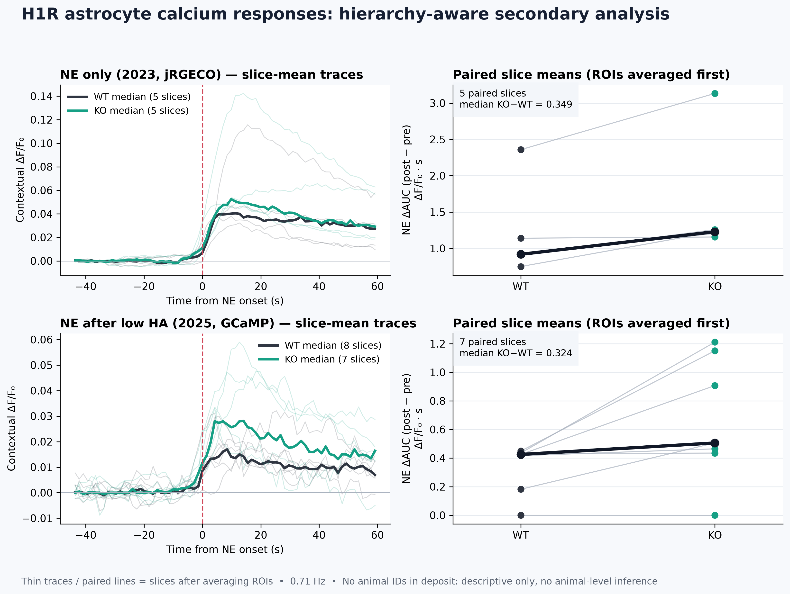
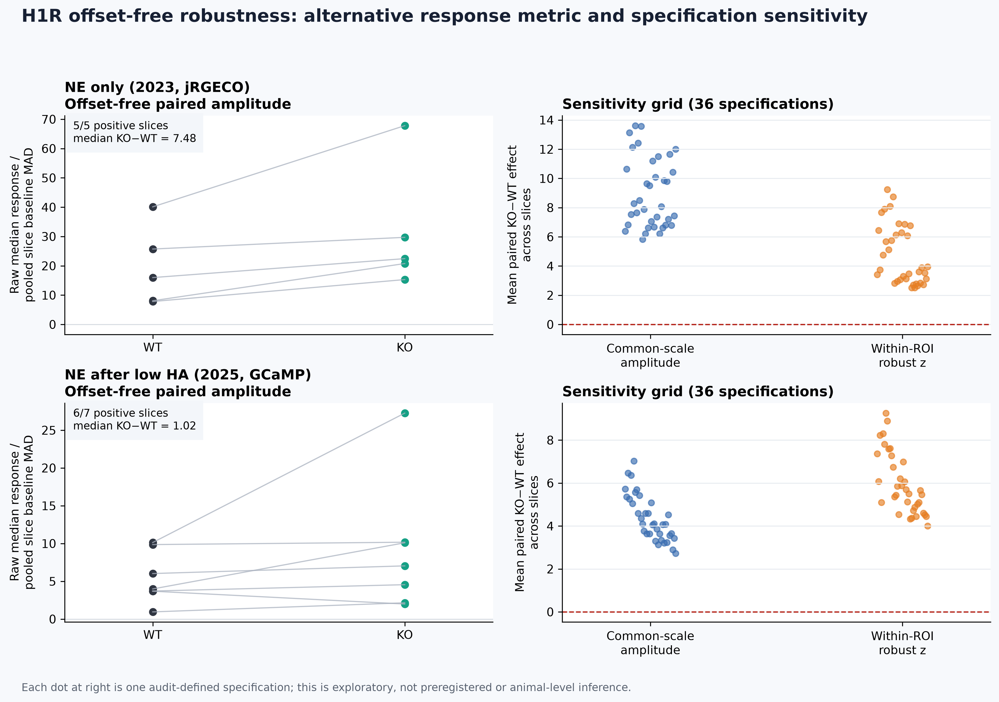

# CADENCE

[](https://github.com/josephreggy23-coder/cadence/actions/workflows/tests.yml)

**Calcium Adaptive Dynamics Engine for Neuroscience, Control, and Estimation**

CADENCE is a reproducible research prototype for testing how calcium-indicator
memory affects latent-state inference and downstream in-silico control. It pairs
a labelled synthetic benchmark with a hierarchy-aware secondary analysis of
public mouse astrocyte recordings.

> **Research status:** synthetic methods benchmark plus exploratory public-data
> analysis. CADENCE is not evidence of treatment efficacy, a confirmed astrocyte
> state mechanism, or a clinical controller.

## Research question

Can a sensor-aware model separate simulated state dynamics from
calcium-indicator memory, and which assumptions determine whether model-based
control appears to work?

## Evidence at a glance

| Evidence | Design | Current result | Interpretation |
| --- | --- | --- | --- |
| Synthetic state recovery | Four-state simulator; fit on 10 intact traces and score on 20 held-out traces | 89.0% offline-smoothed accuracy; 83.4% causal-filter accuracy | The estimator handles indicator memory under this simulator; online inference is harder |
| Synthetic exit-hazard recovery | Causal states; retrospectively standardized shared exposure decay of 0.90; whole-trace bootstrap | Intact `b1 = 0.694`, 95% CI `[0.558, 0.847]`; intact−blocked difference `0.725` `[0.580, 0.864]` | Recovers a contrast deliberately encoded in simulation; not a biochemical measurement |
| Real astrocyte secondary analysis | Public H1R data; 147 ROIs nested in 13 slices; ROIs aggregated before slice comparison | KO−WT response ΔAUC positive in 5/5 and 6/7 paired slices | Descriptive biological context; animal identifiers are unavailable |
| Offset-free H1R robustness | Alternative median-response metric on the same recordings, common within-slice MAD scale, and 36-specification grid | Common-scale KO−WT effect positive in 5/5 and 6/7 slices; mean effect positive in all 36 specifications in both cohorts | Direction is not created by the `+100,000` offset, but this is not an independent dataset or assay and a stricter per-ROI z check is less consistent |
| In-silico controller | Intervention and endogenous escape share one simulated coefficient | Control is disabled when that coefficient is near zero | Structural code/model check, not independent biological validation |

## Real astrocyte analysis

CADENCE analyzes two cohorts from Taylor et al.'s public mouse cortical
astrocyte histamine-1-receptor dataset. It follows the deposited preprocessing,
computes norepinephrine post-minus-pre response ΔAUC, and averages ROIs within
each slice before comparing wild-type and knockout signals.

<p align="center">
  
</p>

The paired slice differences point in the same direction in most slices across
both deposited cohorts. They are not animal-level estimates: the deposited
tables omit animal identifiers, slices and ROIs cannot be treated as independent
animals, and the two sensor/protocol cohorts are not pooled. One slice with a
markedly different raw fluorescence scale is flagged and retained rather than
silently excluded. No p-value is reported.

See the [real-data methods](docs/real_data.md), [machine-readable
summary](results/h1r_astrocyte_summary.json), and [derived-data
provenance](data/processed/h1r_astrocytes_v1_provenance.json).

### Offset-free robustness check

This is an alternative analysis of the same recordings, not an independent
replication, assay, or dataset. It does not reuse contextual ΔF/F₀ or AUC and measures each
ROI's raw median post-minus-pre response and divides the paired slice contrast by
one robust baseline MAD scale shared by both genotypes. This check is invariant
to the arbitrary additive fluorescence offset and to common positive gain.

- NE only: mean KO−WT effect `+11.663` baseline-MAD units; 5/5 slices positive.
- NE after low histamine: mean `+3.559`; 6/7 slices positive.
- Across an audit-defined 36-specification grid, the mean effect stayed positive
  in every specification in both cohorts.
- A stricter within-ROI noise-standardized check was less uniform: 3/5 and 5/7
  slices were positive. That disagreement is retained as a limitation.

<p align="center">
  
</p>

The grid was defined after the primary data had been inspected. It is an
exploratory multiverse analysis, not a preregistration or confirmatory test.

## Synthetic benchmark

Real recordings do not provide frame-level state labels or known parameters, so
the synthetic benchmark supplies both. A fixed four-state simulator is passed
through GCaMP-like sensor kinetics and noise. The sensor-aware model is
then evaluated on traces withheld from fitting.

The shared 0.90 exposure decay was standardized during the repository audit,
not prospectively preregistered. It is held fixed across conditions to prevent
condition-specific tuning.

The downstream variable `L` is a causal accumulator of recent inferred
high-state occupancy. It is a dwell-history proxy—not measured molecular
calcium load. Likewise, four states make a controlled, interpretable benchmark;
they have not been established as discrete astrocyte biology.

The causal blocked estimate is `−0.030` (`[−0.058, −0.005]`) even though the
oracle-state interval includes zero. This small false-positive null bias from
hard causal labels is reported explicitly; the cross-condition contrast—not the
blocked point estimate alone—is the synthetic result.

<details>
<summary>Show synthetic benchmark figures</summary>

<p align="center">
  
  
</p>

The controller figures test behavior under the simulator's assumed plant. The
blocked case is expected algebraically because `b1` multiplies both the
endogenous exit term and the intervention term. A hard adaptive exposure budget
was added after causal validation revealed that the heuristic futility check can
miss non-response. Lower cumulative cost is therefore a constraint, not an
efficiency discovery; CADENCE can also use a larger peak dose than open loop.

<p align="center">
  
</p>

</details>

## Reproduce

Python 3.11 or newer is recommended.

```bash
python -m pip install -r requirements.txt

# Recreate the compact reference benchmark and all versioned analyses
python src/run_all.py --quick --n_traces 30 --fit_traces 10 --control_traces 6

# Run unit and claim-level regression checks
python -m unittest discover -s tests -v
python tests/test_pipeline.py
```

The versioned compact H1R export is sufficient to reproduce the public-data
analysis with Python. Re-exporting it from the original MATLAB tables is optional
and documented in [docs/real_data.md](docs/real_data.md).

Raw Dryad and DANDI source files are not committed. The compact H1R export keeps
the source DOI, Dryad file IDs, and SHA-256 checksums. `real_data.py` also tests
NWB ingestion on a pan-neuronal zebrafish recording from DANDI:001076; that asset
is an out-of-domain loader/QC check, not glial validation.

## What the repository establishes

- Held-out recovery scoring against labelled synthetic data
- Whole-trace uncertainty for a fixed shared synthetic hazard contrast
- Machine-readable wiring from the learned synthetic law into the controller
- Hierarchy-aware descriptive analysis of public astrocyte fluorescence
- Source checksums, deterministic derived data, continuous integration, and
  explicit limitations

## What it does not establish

- That astrocytes occupy the simulator's four discrete states
- That state-derived exposure measures a molecular feedback pathway
- Animal-level H1R effects from the deposited tables
- Controller efficacy, safety, or mechanism in tissue, animals, or people

## Next decisive experiment

Use an animal-identified glial calcium dataset under a prospectively frozen
analysis plan; compare state-history predictors with predictors computed directly
from fluorescence; and evaluate model mismatch across indicators, sampling rates,
drift, heterogeneous traces, and multiple seeds.

## Research integrity

This repository is not a competition application. The AAN Neuroscience Research
Prize requires the applicant's original research and writing. See [AAN prize
readiness](docs/aan_prize_readiness.md), [AI assistance and
authorship](AI_ASSISTANCE.md), [references](docs/references.md), [citation
metadata](CITATION.cff), and the [contribution guide](CONTRIBUTING.md).

## Author

Joseph David · [LinkedIn](https://www.linkedin.com/in/joseph-david-85063635a/) ·
[GitHub](https://github.com/josephreggy23-coder)
